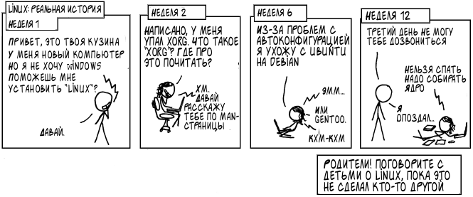

# Работа на ЭВМ и программирование

## Максим Александрович Кривчиков

### к.ф.-м.н., старший научный сотрудник

maxim.krivchikov@gmail.com

https://maxxk.github.io/programming-semester-1/

# Требования

**Поведение в кабинете:** не приходить в кабинет с едой и напитками, не ставить ноги на стол :) правила — на двери кабинета.

**Для получения зачёта:** сдать все выданные вам задачи, сдать автоматизированный зачёт.

**Автоматизированный зачёт:** ~ 20 декабря; нужно за полтора часа написать решение задачи и сделать так, чтобы она проходила наборы случайно сгенерированных тестов. Если на каком-то тесте программа не работает, вам будет показан её вывод и набор, на котором она "сломалась". 

Сдавать задачи можно только на компьютерах в дисплейных классах. 

# Операционная система GNU/Linux

## Предостережение



*Это действительно реальная история, и она ещё не знает, что попала в мой комикс, потому что у неё уже месяц не работает Wi-Fi.*

Original: https://xkcd.com/456/

# Окружение GNU/Linux

1. Для Windows 10: Linux-окружение (Windows Subsystem for Linux) можно установить из Windows Marketplace (рекомендую)

https://www.microsoft.com/ru-ru/p/ubuntu-1804/9n9tngvndl3q

2. Для любителей приключений: записать загрузочный образ на флешку (осторожно: это первый шаг к установке Linux :)

https://unetbootin.github.io/

Советую для начинающих выбрать Ubuntu 18.04.

# Литература

1. Лучше всего — материалы, рекомендуемые лектором.

2. Язык программирования C:

- Учебник: А.В. Столяров (ВМК). Программирование: введение в профессию. II: Низкоуровневое программирование
    http://stolyarov.info/books/programming_intro/vol2

- Справочник: Г. Шилдт. Полный справочник по C.

- Man-страницы в командной строке (Например: `man 2 printf`)

- На английском (привыкайте): https://zealdocs.org/ 

3. Окружение GNU/Linux:

- Краткая справка, С.А. Афонин (мехмат). http://serg.tk/static/docs/1/memosheet.pdf 

# Hello, World!

Гостевая учётная запись:

Логин: student
Пароль: mexmat


```c
#include <stdio.h>

int main(void) 
{
    printf("Hello world!\n");
    return 0;
} 
```
